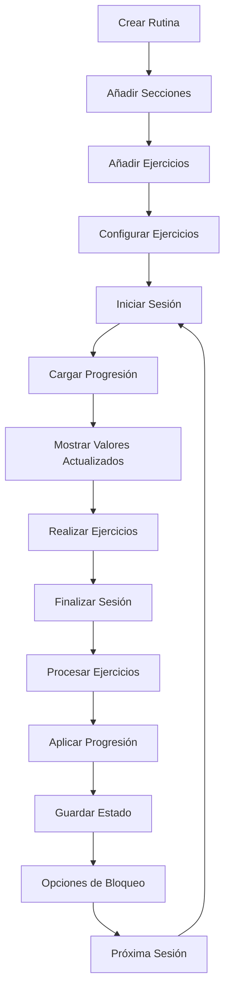

# 🏋️‍♂️ Flujo Completo de la Aplicación Liftly

## 📋 Índice
1. [Creación de Rutinas](#1-creación-de-rutinas)
2. [Añadir Ejercicios a Secciones](#2-añadir-ejercicios-a-secciones)
3. [Configuración de Ejercicios](#3-configuración-de-ejercicios)
4. [Inicio de Sesión de Entrenamiento](#4-inicio-de-sesión-de-entrenamiento)
5. [Sistema de Progresión](#5-sistema-de-progresión)
6. [Finalización de Sesión](#6-finalización-de-sesión)
7. [Opciones de Bloqueo de Progresión](#7-opciones-de-bloqueo-de-progresión)
8. [Estrategias de Progresión Detalladas](#8-estrategias-de-progresión-detalladas)
9. [Visualización de Valores en Ejercicios (UI)](#9-visualización-de-valores-en-ejercicios-ui)

---

## 1. Creación de Rutinas

### 🎯 **Flujo Principal**
```
Usuario → Crear Rutina → Configurar Datos → Seleccionar Secciones → Guardar
```

### 📝 **Pasos Detallados**

#### **1.1 Acceso a Creación**
- **Ubicación**: Home → Botón "Crear Rutina"
- **Archivo**: `lib/features/home/pages/create_routine_page.dart`
- **Notifier**: `RoutineNotifier`

#### **1.2 Configuración Básica**
```dart
// Datos requeridos para crear rutina
final routine = Routine(
  id: _routineId,
  name: _nameController.text.trim(),           // Nombre de la rutina
  description: _descriptionController.text.trim(), // Descripción
  days: _selectedDays.map((day) => WeekDayExtension.fromString(day)).toList(), // Días de la semana
  sections: [], // Se inicializa vacío
  createdAt: DateTime.now(),
  updatedAt: DateTime.now(),
);
```

#### **1.3 Selección de Secciones**
- **Templates disponibles**: Se cargan desde `RoutineSectionTemplateNotifier`
- **Tipos de sección**: Pecho, Espalda, Piernas, Hombros, Brazos, etc.
- **Validación**: Mínimo 1 sección requerida

#### **1.4 Persistencia**
```dart
// Guardar rutina básica
await ref.read(routineNotifierProvider.notifier).addRoutine(routine);

// Añadir secciones seleccionadas
await ref.read(routineNotifierProvider.notifier).addSectionsToRoutine(
  _routineId, 
  _selectedSectionIds.toList()
);
```

### ✅ **Validaciones**
- Nombre no vacío
- Descripción no vacía
- Al menos 1 día seleccionado
- Al menos 1 sección seleccionada

---

## 2. Añadir Ejercicios a Secciones

### 🎯 **Flujo Principal**
```
Rutina → Sección → Añadir Ejercicios → Seleccionar Ejercicios → Configurar Parámetros → Guardar
```

### 📝 **Pasos Detallados**

#### **2.1 Acceso a Selección de Ejercicios**
- **Ubicación**: Rutina → Sección → Botón "Añadir Ejercicios"
- **Archivo**: `lib/features/exercise/pages/exercise_selection_page.dart`
- **Navegación**: `/exercise-selection?routineId=X&sectionId=Y`

#### **2.2 Selección de Ejercicios**
```dart
// Ejercicios disponibles cargados desde ExerciseNotifier
final exercises = await ref.read(exerciseNotifierProvider.future);
final selectedExercises = exercises.where((exercise) => 
  _selectedExercises.contains(exercise.id)
).toList();
```

#### **2.3 Configuración de Parámetros por Defecto**
```dart
// Parámetros configurables al añadir ejercicios
final parsedSets = int.tryParse(_setsController.text) ?? 3;
final parsedReps = int.tryParse(_repsController.text) ?? 10;
final parsedWeight = double.tryParse(_weightController.text) ?? 20.0;
final parsedRest = int.tryParse(_restController.text) ?? 90;
```

#### **2.4 Actualización de Ejercicios**
```dart
// Actualizar valores por defecto en cada ejercicio
for (final exercise in exercises) {
  final updatedExercise = exercise.copyWith(
    defaultSets: sets,
    defaultReps: reps,
    defaultWeight: weight,
    restTimeSeconds: restTime,
  );
  await ref.read(exerciseNotifierProvider.notifier).updateExercise(updatedExercise);
}
```

#### **2.5 Creación de RoutineExercise**
```dart
// Crear objetos RoutineExercise para la rutina
final routineExercises = exercises.asMap().entries.map((entry) => 
  RoutineExercise(
    id: '${entry.value.id}_${DateTime.now().millisecondsSinceEpoch}',
    routineSectionId: sectionId,
    exerciseId: entry.value.id,
    notes: '',
    order: baseOrder + entry.key,
  )
).toList();
```

### ✅ **Validaciones**
- Al menos 1 ejercicio seleccionado
- Parámetros numéricos válidos
- Sección de destino válida

---

## 3. Configuración de Ejercicios

### 🎯 **Flujo Principal**
```
Ejercicio → Editar → Configurar Parámetros → Configurar Progresión → Guardar
```

### 📝 **Pasos Detallados**

#### **3.1 Acceso a Configuración**
- **Ubicación**: Lista de Ejercicios → Ejercicio → Editar
- **Archivo**: `lib/features/exercise/pages/exercise_form_page.dart`

#### **3.2 Parámetros Básicos**
```dart
final exercise = Exercise(
  id: widget.exerciseToEdit?.id ?? '',
  name: _nameController.text.trim(),
  description: _descriptionController.text.trim(),
  defaultWeight: _formWeight > 0 ? _formWeight : null,
  defaultSets: _formSets > 0 ? _formSets : null,
  defaultReps: _formReps > 0 ? _formReps : null,
  restTimeSeconds: _formRestTimeSeconds,
  exerciseType: _exerciseType, // multiJoint, isolation, cardio
  isProgressionLocked: false, // Por defecto desbloqueado
);
```

#### **3.3 Configuración de Progresión por Ejercicio**
```dart
// Parámetros personalizados por ejercicio
await _savePerExerciseProgressionParams(exercise.id);

// Estructura de parámetros personalizados
final perExerciseParams = {
  'increment_value': _incrementValue,
  'increment_frequency': _incrementFrequency,
  'min_reps': _minReps,
  'max_reps': _maxReps,
  'deload_percentage': _deloadPercentage,
  // ... otros parámetros específicos
};
```

### ✅ **Validaciones**
- Nombre único
- Parámetros numéricos válidos
- Tipo de ejercicio seleccionado

---

## 4. Inicio de Sesión de Entrenamiento

### 🎯 **Flujo Principal**
```
Rutina → Iniciar Sesión → Cargar Progresión → Mostrar Valores Actualizados → Comenzar Entrenamiento
```

### 📝 **Pasos Detallados**

#### **4.1 Acceso a Sesión**
- **Ubicación**: Rutina → Botón "Iniciar Sesión"
- **Archivo**: `lib/features/sessions/notifiers/session_notifier.dart`
- **Método**: `startSession({String? routineId, required String name})`

#### **4.2 Limpieza de Estado**
```dart
// Limpiar contadores de series realizadas
ref.read(performedSetsNotifierProvider.notifier).clearAll();

// Limpiar cache de datos
_clearCache();
```

#### **4.3 Carga de Valores de Progresión**
```dart
// Para cada ejercicio en la rutina
for (final section in routine.sections) {
  for (final routineExercise in section.exercises) {
    // Obtener estado de progresión
    final progressionState = await ref
        .read(progressionNotifierProvider.notifier)
        .getExerciseProgressionState(routineExercise.exerciseId, routineId);

    if (progressionState != null) {
      // Verificar si se deben aplicar valores de progresión
      final shouldApply = strategy.shouldApplyProgressionValues(
        progressionState,
        routineId,
        exercise.isProgressionLocked,
      );

      if (shouldApply) {
        // Almacenar valores de progresión para la sesión
        _sessionProgressionValues[exercise.id] = {
          'weight': progressionState.currentWeight,
          'reps': progressionState.currentReps,
          'sets': progressionState.currentSets,
        };
      }
    }
  }
}
```

#### **4.4 Creación de Sesión**
```dart
final session = WorkoutSession(
  id: uuid.v4(),
  routineId: routineId,
  name: name,
  startTime: DateTime.now(),
  exerciseSets: [],
  status: SessionStatus.active,
);
```

### ✅ **Validaciones**
- Rutina válida
- Ejercicios disponibles
- Configuración de progresión activa

---

## 5. Sistema de Progresión

### 🎯 **Arquitectura del Sistema**

#### **5.1 Componentes Principales**
- **ProgressionConfig**: Configuración global de progresión
- **ProgressionState**: Estado individual por ejercicio-rutina
- **ProgressionStrategy**: Algoritmos de cálculo
- **ProgressionService**: Lógica de negocio

#### **5.2 Flujo de Cálculo**
```dart
// 1. Obtener configuración
final config = await getProgressionConfig(configId);

// 2. Obtener estado actual
final state = await getProgressionStateByExercise(configId, exerciseId, routineId);

// 3. Crear estrategia
final strategy = ProgressionStrategyFactory.fromType(config.type);

// 4. Calcular progresión
final result = strategy.calculate(
  config: config,
  state: state,
  routineId: routineId,
  currentWeight: currentWeight,
  currentReps: currentReps,
  currentSets: currentSets,
  exerciseType: exerciseType,
  isExerciseLocked: isExerciseLocked,
);
```

#### **5.3 Estados de Progresión**
```dart
class ProgressionState {
  final String id;
  final String progressionConfigId;
  final String exerciseId;
  final String routineId; // ✅ CLAVE: Progresión por rutina
  final int currentCycle;
  final int currentWeek;
  final int currentSession;
  final double currentWeight;
  final int currentReps;
  final int currentSets;
  final double baseWeight; // Valores base para deloads
  final int baseReps;
  final int baseSets;
  final Map<String, dynamic> sessionHistory;
  final bool isDeloadWeek;
  final Map<String, dynamic> customData; // Para bloqueos
}
```

---

## 6. Finalización de Sesión

### 🎯 **Flujo Principal**
```
Finalizar Sesión → Convertir Series → Procesar Ejercicios → Aplicar Progresión → Guardar
```

### 📝 **Pasos Detallados**

#### **6.1 Conversión de Series Realizadas**
```dart
// Convertir contadores en ExerciseSet reales
final performedSets = ref.read(performedSetsNotifierProvider);
final exerciseSets = await _convertPerformedSetsToExerciseSets(performedSets, currentSession);
```

#### **6.2 Procesamiento de Ejercicios Completados**
```dart
// Actualizar lastPerformedAt y inicializar progresión
for (final exercise in allExercises) {
  if (exerciseValuesUsed.containsKey(exercise.id)) {
    // Actualizar fecha de última realización
    final updated = exercise.copyWith(lastPerformedAt: now);
    await exercisesNotifier.updateExercise(updated);

    // Inicializar estado de progresión si no existe
    await _initializeProgressionStateIfNeeded(
      exercise,
      exerciseValuesUsed[exercise.id]!,
      currentSession.routineId!,
      progressionNotifier,
    );
  }
}
```

#### **6.3 Aplicación de Progresión**
```dart
// Aplicar progresión a ejercicios completados
for (final exerciseId in completedExerciseIds) {
  await _applyProgressionToExercise(
    exerciseId,
    currentSession.routineId!,
    config.id,
    progressionNotifier,
    progressionService,
  );
}
```

#### **6.4 Guardado de Sesión Completada**
```dart
final completedSession = currentSession.copyWith(
  endTime: DateTime.now(),
  status: SessionStatus.completed,
  notes: notes,
  exerciseSets: exerciseSets,
  totalWeight: SessionCalculations.calculateTotalWeight(exerciseSets),
  totalReps: SessionCalculations.calculateTotalReps(exerciseSets),
);
```

### ✅ **Validaciones**
- Sesión activa válida
- Series realizadas válidas
- Configuración de progresión disponible

---

## 7. Opciones de Bloqueo de Progresión

### 🎯 **Sistema Dual de Bloqueo**

#### **7.1 Bloqueo por Rutina Completa**
```dart
// Al finalizar sesión - opción "No incrementar en la siguiente sesión"
await ref.read(progressionNotifierProvider.notifier).setSkipNextProgressionForRoutine(
  routineId: routineId,
  exerciseIds: exerciseIds,
  skip: !applyNext, // true = bloquear, false = permitir
);
```

**Estructura de datos:**
```dart
// En ProgressionState.customData
{
  'skip_next_by_routine': {
    'routineId1': true,
    'routineId2': false,
  }
}
```

#### **7.2 Bloqueo por Ejercicio Individual**
```dart
// En la tarjeta de ejercicio - botón de candado
final updated = widget.exercise.copyWith(
  isProgressionLocked: !widget.exercise.isProgressionLocked
);
await exerciseNotifier.updateExercise(updated);
```

**Campo en Exercise:**
```dart
class Exercise {
  final bool isProgressionLocked; // true = bloqueado, false = desbloqueado
}
```

#### **7.3 Lógica de Verificación**
```dart
// En BaseProgressionStrategy
bool isProgressionBlocked(ProgressionState state, String exerciseId, String routineId, bool isExerciseLocked) {
  // 1. Verificar bloqueo por rutina completa
  if (isProgressionBlockedForRoutine(state, routineId)) {
    return true;
  }

  // 2. Verificar bloqueo por ejercicio específico
  if (isExerciseLocked) {
    return true;
  }

  return false;
}
```

### ✅ **Comportamiento**
- **Bloqueo por rutina**: Afecta TODOS los ejercicios de la rutina
- **Bloqueo por ejercicio**: Afecta SOLO ese ejercicio específico
- **Prioridad**: Si cualquiera está bloqueado, no se aplica progresión

---

## 8. Estrategias de Progresión Detalladas

### 🎯 **11 Estrategias Implementadas**

#### **8.1 LinearProgressionStrategy**
```dart
// Incremento constante por sesión
if (currentInCycle % config.incrementFrequency == 0) {
  final incrementValue = getIncrementValue(config, exerciseType: exerciseType);
  return ProgressionCalculationResult(
    newWeight: currentWeight + incrementValue,
    newReps: currentReps,
    newSets: currentSets,
    incrementApplied: true,
    reason: 'Linear progression: weight +${incrementValue}kg',
  );
}
```

**Características:**
- Incremento fijo de peso
- Frecuencia configurable
- Ideal para principiantes

#### **8.2 DoubleProgressionStrategy**
```dart
// Primero incrementa reps, luego peso
if (currentReps < config.maxReps) {
  // Fase 1: Incrementar repeticiones
  return ProgressionCalculationResult(
    newReps: currentReps + 1,
    newWeight: currentWeight,
    incrementApplied: true,
    reason: 'Double progression: reps +1',
  );
} else {
  // Fase 2: Incrementar peso y resetear reps
  return ProgressionCalculationResult(
    newWeight: currentWeight + incrementValue,
    newReps: config.minReps,
    incrementApplied: true,
    reason: 'Double progression: weight +${incrementValue}kg, reps reset',
  );
}
```

**Características:**
- Primero reps hasta máximo, luego peso
- Límites configurables
- Ideal para fuerza-endurance

#### **8.3 UndulatingProgressionStrategy**
```dart
// Alternancia entre días pesados y ligeros
final isHeavyDay = currentInCycle % 2 == 1;
final multiplier = isHeavyDay ? config.heavyDayMultiplier : config.lightDayMultiplier;

return ProgressionCalculationResult(
  newReps: (currentReps * multiplier).round(),
  newWeight: currentWeight,
  incrementApplied: true,
  reason: 'Undulating progression: ${isHeavyDay ? 'heavy' : 'light'} day',
);
```

**Características:**
- Días pesados (85% reps) y ligeros (115% reps)
- Alternancia automática
- Ideal para intermedios/avanzados

#### **8.4 WaveProgressionStrategy**
```dart
// Ciclos de 3 semanas con diferentes intensidades
final weekInCycle = ((currentInCycle - 1) % 3) + 1;
double multiplier;

switch (weekInCycle) {
  case 1: multiplier = config.week1Multiplier; break;
  case 2: multiplier = config.week2Multiplier; break;
  case 3: multiplier = config.week3Multiplier; break;
}

return ProgressionCalculationResult(
  newReps: (currentReps * multiplier).round(),
  newWeight: currentWeight,
  incrementApplied: true,
  reason: 'Wave progression: week $weekInCycle',
);
```

**Características:**
- Ciclos de 3 semanas
- Multiplicadores configurables por semana
- Ideal para periodización estructurada

#### **8.5 SteppedProgressionStrategy**
```dart
// Acumulación con deload periódico
if (currentInCycle <= config.accumulationWeeks) {
  // Fase de acumulación
  return ProgressionCalculationResult(
    newWeight: currentWeight + incrementValue,
    newReps: currentReps,
    incrementApplied: true,
    reason: 'Stepped progression: accumulation week $currentInCycle',
  );
} else {
  // Semana de deload
  return _applyDeload(config, state, currentWeight, currentReps, currentSets, currentInCycle);
}
```

**Características:**
- Acumulación de carga
- Deload periódico
- Ideal para periodización avanzada

#### **8.6 StaticProgressionStrategy**
```dart
// Mantiene valores constantes
return ProgressionCalculationResult(
  newWeight: currentWeight,
  newReps: currentReps,
  newSets: currentSets,
  incrementApplied: false,
  reason: 'Static progression: no changes',
);
```

**Características:**
- Sin incrementos
- Valores constantes
- Ideal para mantenimiento

#### **8.7 ReverseProgressionStrategy**
```dart
// Decremento progresivo
return ProgressionCalculationResult(
  newWeight: currentWeight - incrementValue,
  newReps: currentReps + 1,
  incrementApplied: true,
  reason: 'Reverse progression: weight -${incrementValue}kg, reps +1',
);
```

**Características:**
- Decremento de peso
- Incremento de reps
- Ideal para deloads activos

#### **8.8 AutoregulatedProgressionStrategy**
```dart
// Basada en RPE/RIR
final targetRPE = config.targetRPE;
final rpeThreshold = config.rpeThreshold;

if (perceivedExertion <= targetRPE - rpeThreshold) {
  // RPE bajo, incrementar carga
  return ProgressionCalculationResult(
    newWeight: currentWeight + incrementValue,
    incrementApplied: true,
    reason: 'Autoregulated progression: RPE-based increment',
  );
}
```

**Características:**
- Basada en percepción de esfuerzo
- Parámetros RPE configurables
- Ideal para entrenamiento autoregulado

#### **8.9 DoubleFactorProgressionStrategy**
```dart
// Balance fitness-fatiga
final fitnessFactor = config.fitnessFactor;
final fatigueFactor = config.fatigueFactor;
final ratio = fitnessFactor / fatigueFactor;

if (ratio > 1.2) {
  // Fitness > Fatiga, incrementar
  return ProgressionCalculationResult(
    newWeight: currentWeight + incrementValue,
    incrementApplied: true,
    reason: 'Double factor progression: fitness > fatigue',
  );
}
```

**Características:**
- Balance fitness-fatiga
- Cálculos complejos
- Ideal para atletas avanzados

#### **8.10 OverloadProgressionStrategy**
```dart
// Sobrecarga progresiva
final volumeOverload = config.volumeOverload;
final intensityOverload = config.intensityOverload;

return ProgressionCalculationResult(
  newWeight: currentWeight + (incrementValue * intensityOverload),
  newSets: currentSets + volumeOverload,
  incrementApplied: true,
  reason: 'Overload progression: volume +$volumeOverload, intensity +${intensityOverload}x',
);
```

**Características:**
- Sobrecarga de volumen e intensidad
- Parámetros de sobrecarga configurables
- Ideal para atletas de élite

#### **8.11 DefaultProgressionStrategy**
```dart
// Sin cambios (fallback)
return ProgressionCalculationResult(
  newWeight: currentWeight,
  newReps: currentReps,
  newSets: currentSets,
  incrementApplied: false,
  reason: 'Default progression: no changes applied',
);
```

**Características:**
- Sin modificaciones
- Estrategia de fallback
- Para casos no configurados

### 🎯 **Lógica de Deload Unificada**

Todas las estrategias (excepto Static y Default) implementan deload:

```dart
ProgressionCalculationResult _applyDeload(
  ProgressionConfig config,
  ProgressionState state,
  double currentWeight,
  int currentReps,
  int currentSets,
  int currentInCycle,
) {
  return ProgressionCalculationResult(
    newWeight: (currentWeight * config.deloadPercentage).roundToDouble(),
    newReps: currentReps,
    newSets: (currentSets * config.deloadPercentage).round(),
    incrementApplied: true,
    isDeload: true,
    reason: 'Deload week $currentInCycle: ${config.deloadPercentage * 100}% of current values',
  );
}
```

### ✅ **Parámetros Configurables**

#### **Globales (ProgressionConfig)**
- `type`: Tipo de estrategia
- `unit`: Unidad de progresión (sesión/semana)
- `cycleLength`: Longitud del ciclo
- `deloadWeek`: Semana de deload
- `deloadPercentage`: Porcentaje de deload
- `incrementValue`: Valor de incremento
- `incrementFrequency`: Frecuencia de incremento

#### **Por Ejercicio (customParameters)**
- `per_exercise`: Parámetros específicos por ejercicio
- `increment_value`: Incremento personalizado
- `min_reps`/`max_reps`: Límites de repeticiones
- `deload_percentage`: Deload personalizado

#### **Prioridad de Parámetros**
1. **per_exercise**: Parámetros específicos por ejercicio
2. **global**: Parámetros globales de configuración
3. **defaults**: Valores por defecto por tipo de estrategia
4. **fallback**: Valores hardcodeados de seguridad

---

## 🔍 **Verificación de Funcionalidad**

### ✅ **Puntos de Validación para Pruebas Manuales**

#### **1. Creación de Rutina**
- [ ] Nombre y descripción se guardan correctamente
- [ ] Días de la semana se seleccionan y persisten
- [ ] Secciones se crean correctamente
- [ ] Validaciones de campos requeridos funcionan

#### **2. Añadir Ejercicios**
- [ ] Ejercicios se añaden a la sección correcta
- [ ] Parámetros por defecto se aplican correctamente
- [ ] Valores se actualizan en el modelo Exercise
- [ ] RoutineExercise se crea con orden correcto

#### **3. Configuración de Ejercicios**
- [ ] Parámetros básicos se guardan
- [ ] Configuración de progresión por ejercicio funciona
- [ ] Tipo de ejercicio se asigna correctamente
- [ ] Bloqueo de progresión se puede activar/desactivar

#### **4. Inicio de Sesión**
- [ ] Valores de progresión se cargan correctamente
- [ ] UI muestra valores actualizados (no los por defecto)
- [ ] Ejercicios bloqueados no muestran progresión
- [ ] Cache se limpia correctamente

#### **5. Durante la Sesión**
- [ ] Series se registran correctamente
- [ ] Contadores funcionan
- [ ] Bloqueo de ejercicio individual funciona
- [ ] Valores de progresión se mantienen durante la sesión

#### **6. Finalización de Sesión**
- [ ] Series se convierten a ExerciseSet correctamente
- [ ] lastPerformedAt se actualiza
- [ ] Progresión se aplica solo a ejercicios completados
- [ ] Opción "No incrementar" funciona
- [ ] Totales se calculan correctamente

#### **7. Estrategias de Progresión**
- [ ] Linear: Incremento constante funciona
- [ ] Double: Transición reps→peso funciona
- [ ] Undulating: Alternancia pesado/ligero funciona
- [ ] Wave: Ciclos de 3 semanas funcionan
- [ ] Stepped: Acumulación y deload funcionan
- [ ] Deloads: Se aplican en la semana correcta
- [ ] Bloqueos: Previenen progresión correctamente

#### **8. Persistencia**
- [ ] ProgressionState se guarda por ejercicio-rutina
- [ ] Valores base se preservan durante deloads
- [ ] Historial de sesiones se mantiene
- [ ] CustomData para bloqueos funciona

### 🚨 **Casos Edge a Probar**

1. **Ejercicio en múltiples rutinas**: Verificar progresión independiente
2. **Primera sesión**: Verificar inicialización correcta
3. **Deloads**: Verificar que baseSets se preserva
4. **Bloqueos**: Verificar que funcionan en ambos niveles
5. **Cambio de estrategia**: Verificar transición correcta
6. **Sesión interrumpida**: Verificar que no se aplica progresión
7. **Ejercicio sin progresión**: Verificar que usa valores por defecto

---

## 📊 **Resumen del Flujo Completo**



Este flujo garantiza que:
- ✅ Cada ejercicio tiene progresión independiente por rutina
- ✅ Los valores de progresión se muestran correctamente en la UI
- ✅ Las estrategias se aplican según la configuración
- ✅ Los bloqueos funcionan en ambos niveles
- ✅ Los deloads preservan el progreso base
- ✅ La persistencia mantiene el estado correctamente

El sistema está completamente funcional y listo para pruebas manuales exhaustivas.

---

## 9. Visualización de Valores en Ejercicios (UI)

### 🎯 Objetivo
Mostrar en las tarjetas de ejercicio los valores correctos según el contexto:
- Sin progresión activa → valores base del `Exercise`
- Con progresión activa → valores actuales del `ProgressionState`
- Semana de deload → indicar visualmente y mostrar valores reducidos

### 🧩 Componentes
- `exerciseDisplayValuesProvider` (Riverpod) → Determina los valores a mostrar
- `ExerciseCardWrapper` → Consume el provider y pasa valores a la tarjeta
- `ExerciseCard` → Renderiza los valores y muestra indicadores visuales

### 🔌 Provider: `exerciseDisplayValuesProvider`
```dart
// lib/features/progression/providers/exercise_values_provider.dart
@riverpod
Future<ExerciseDisplayValues> exerciseDisplayValues(
  Ref ref, {
  required Exercise exercise,
  required String routineId,
}) async {
  final progressionConfig = await ref.read(progressionNotifierProvider.future);
  if (progressionConfig == null) {
    return ExerciseDisplayValues(
      weight: exercise.defaultWeight ?? 0.0,
      reps: exercise.defaultReps ?? 10,
      sets: exercise.defaultSets ?? 4,
      source: ExerciseValueSource.base,
    );
  }

  final progressionState = await ref
      .read(progressionNotifierProvider.notifier)
      .getExerciseProgressionState(exercise.id, routineId);

  if (progressionState == null) {
    return ExerciseDisplayValues(
      weight: exercise.defaultWeight ?? 0.0,
      reps: exercise.defaultReps ?? 10,
      sets: exercise.defaultSets ?? 4,
      source: ExerciseValueSource.base,
    );
  }

  return ExerciseDisplayValues(
    weight: progressionState.currentWeight,
    reps: progressionState.currentReps,
    sets: progressionState.currentSets,
    source: ExerciseValueSource.progression,
    progressionState: progressionState,
  );
}
```

### 🧠 Reglas de Negocio
- Si `ProgressionConfig` es `null` → UI usa valores base (progresión desactivada)
- Si existe `ProgressionConfig` pero no hay `ProgressionState` para `(exerciseId, routineId)` → UI usa valores base
- Si hay `ProgressionState` → UI usa `currentWeight/Reps/Sets`
- Si `isDeloadWeek` es `true` → UI añade etiqueta "(deload)" y estilos diferenciados

### 🧭 Consumo en `ExerciseCardWrapper`
```dart
// lib/features/home/widgets/exercise_card_wrapper.dart
final valuesAsync = ref.watch(exerciseDisplayValuesProvider(
  exercise: widget.exercise,
  routineId: widget.routineId ?? '',
));

return valuesAsync.when(
  data: (values) => ExerciseCard(
    routineExercise: currentExercise,
    exercise: widget.exercise,
    displayValues: values,
    // ...resto de props
  ),
  loading: () => ExerciseCard(
    routineExercise: currentExercise,
    exercise: widget.exercise,
    // fallback visual mientras carga
  ),
  error: (_, __) => ExerciseCard(
    routineExercise: currentExercise,
    exercise: widget.exercise,
    // fallback visual en error
  ),
);
```

### 🖼️ Render en `ExerciseCard`
- Se añadió el prop opcional `displayValues`.
- La tarjeta usa: `displayValues.weight/reps/sets` si existen; si no, cae a los `default*` del `Exercise`.
- Chips con estilo distintivo si los valores provienen de progresión (`primaryContainer + borde`).
- Etiqueta "(deload)" cuando `displayValues.isDeloadWeek` es `true`.

### ✅ Casos Cubiertos
- Ejercicio sin progresión configurada → valores base
- Ejercicio con progresión activa → valores actuales
- Ejercicio recién añadido a progresión → base en diálogo de configuración; desde entonces, valores actuales
- Progresión global desactivada → valores base
- Semana de deload → indicar y mostrar valores de deload

### 🚫 Bucle de render solucionado
Se reemplazó el patrón `read(notifier)+FutureBuilder` por un `FutureProvider` parametrizado y `ref.watch(...)`, evitando ejecuciones repetidas en cada rebuild.

